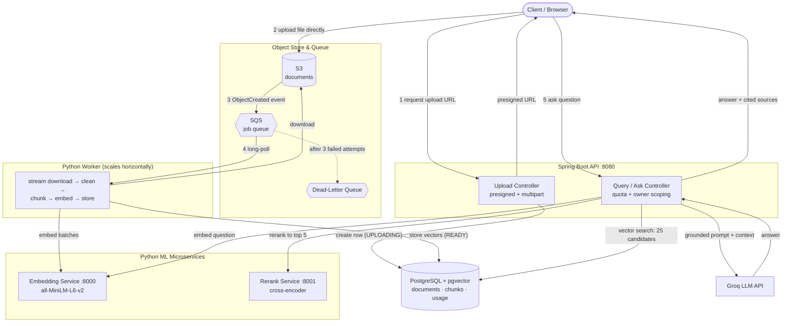

# DocMind — Document Intelligence Platform

**Upload any PDF and ask questions about it in plain English. DocMind returns answers grounded in the document itself, with the exact source passages cited — engineered like a production system, not a script.**

DocMind is a backend-heavy, event-driven **Retrieval-Augmented Generation (RAG)** platform. The "chat with your PDF" experience is a well-known pattern; the focus of this project is the **distributed systems engineering** underneath it — asynchronous processing, horizontal scalability, memory-safe handling of multi-gigabyte files, real reliability guarantees, and a two-stage retrieval pipeline that prioritizes answer quality.

---

## Why DocMind?

Most "chat with PDF" implementations are a single synchronous process: you upload a file, the request blocks while it's parsed, and it falls over on a large file or under concurrent load. DocMind is built the way a real backend service would be.

| | Typical "chat with PDF" | **DocMind** |
|---|---|---|
| **Processing** | Synchronous — the request blocks while the file is parsed | Asynchronous — the upload returns instantly; processing happens in a decoupled worker |
| **Large files** | Loads the whole file into memory (fails on big PDFs) | Streams to disk and processes page-by-page at **bounded, constant memory** |
| **Uploads** | Routed through the app server | **Direct-to-S3** via presigned URLs (multipart, up to 5 TB), bypassing the server |
| **Scaling** | Single process — one big job blocks everyone | **Horizontally scalable** worker fleet pulling from a shared queue |
| **Reliability** | A crash loses the job | **Retries, dead-letter queue, idempotent reprocessing, crash recovery** |
| **Answer quality** | Naive top-k vector search | **Two-stage retrieval**: wide vector search + cross-encoder reranking |
| **Configuration** | Hardcoded | Fully **environment-driven** — the same code runs locally and in the cloud |

The core idea is simple and honest: the RAG *technique* is the same everywhere. What sets this apart is the **production-shaped infrastructure** around it, and the fact that every architectural decision was made deliberately with its trade-offs understood.

---

## Architecture



### Components

- **Spring Boot API** — the front door. Issues presigned upload URLs (single-PUT and multipart), and serves the `query` and `ask` endpoints. Enforces per-user document scoping and the anonymous question quota.
- **S3** — object storage for the raw documents. Clients upload straight to it; the API never handles file bytes.
- **SQS** — the queue that decouples upload from processing. It buffers bursts and lets the worker tier scale independently. A dead-letter queue captures messages that fail repeatedly.
- **Python Worker** — consumes S3 events from SQS, streams the file to disk, extracts and cleans text, chunks it, embeds each chunk, and stores the vectors. Stateless and horizontally scalable (competing-consumers pattern).
- **Embedding Service** (FastAPI) — wraps the sentence-transformer model. Owned by one service so chunks and queries are always embedded by the *same* model, keeping their vectors comparable.
- **Rerank Service** (FastAPI) — a cross-encoder that scores `(question, passage)` pairs for the second retrieval stage.
- **PostgreSQL + pgvector** — stores document metadata, the text chunks and their vector embeddings, and the anonymous usage counters. Vector similarity search runs in the database.
- **Groq** — hosted LLM inference for generating the final grounded answer.

---

## How It Works

### Ingestion (asynchronous)

1. The client asks the API for an upload URL. The API creates a `documents` row with status `UPLOADING` and returns a **presigned S3 URL** (or, for large files, a set of multipart part URLs).
2. The client uploads the file **directly to S3**, bypassing the API entirely — the backend stays stateless and low-memory.
3. S3 fires an `ObjectCreated` event to SQS.
4. A worker long-polls SQS, picks up the event, sets the document to `PROCESSING`, and **streams the file to a temp file on disk** (never into RAM).
5. It reads the PDF **page by page**, cleans whitespace, slices overlapping chunks, embeds them in batches, and writes the vectors to pgvector — all at bounded memory. On success the document is marked `READY`.

**Reliability:** a failed message is *not* deleted, so SQS redelivers it (idempotent reprocessing makes retries safe). After 3 attempts it moves to the dead-letter queue. A worker that crashes mid-job never deletes its message, so the job is automatically retried — no orphaned work.

### Retrieval (two-stage)

Vector distance is only a *proxy* for relevance, so a single nearest-neighbor lookup often ranks the truly relevant passage below fluffier, same-topic chunks. DocMind uses a **retrieve-then-rerank** pipeline:

1. **Wide vector search** — embed the question and pull the nearest **25** candidate chunks from pgvector (cheap; casts a broad net).
2. **Cross-encoder rerank** — re-score those 25 candidates by reading the question and each passage *together*, and keep the **top 5**. Far more accurate than comparing two separate vectors, at a fraction of the cost of running it over the whole corpus.
3. **Grounded generation** — send the question plus the reranked passages to the LLM with a system prompt that restricts it to the provided context, so answers are grounded and cite their sources (or admit when the answer isn't present).

### Anonymous / Freemium access

There is no login wall. Each browser mints a random ID sent as an `X-Anonymous-Id` header, which serves as both the document owner (so each browser sees only its own uploads) and the quota key (**10 free questions**, enforced atomically in Postgres, then a `429`).

---

## Tech Stack (and why)

| Layer | Choice | Why |
|---|---|---|
| **API** | Java · Spring Boot | Strong typing, mature ecosystem, first-class AWS SDK; ideal for the orchestration/API tier |
| **Worker & ML** | Python · FastAPI | Access to the ML ecosystem (sentence-transformers, PyMuPDF); FastAPI for lightweight inference microservices |
| **Object store** | AWS S3 | Presigned direct uploads keep the API stateless; multipart supports very large files |
| **Queue** | AWS SQS | Decouples ingestion from processing, enables horizontal scaling and dead-lettering |
| **Database** | PostgreSQL + pgvector | One store for both metadata and vectors — no separate vector DB to operate |
| **Embeddings** | `all-MiniLM-L6-v2` (384-dim) | Small, fast, strong quality-for-size; runs comfortably on CPU |
| **Reranker** | `cross-encoder/ms-marco-MiniLM-L-6-v2` | Standard, fast cross-encoder for high-precision reranking |
| **LLM** | Groq | Fast, OpenAI-compatible inference with a generous free tier |
| **Local infra** | Docker · LocalStack | S3 + SQS emulated locally, so the whole system runs on one machine with no cloud account |

---

## Getting Started

### Prerequisites

- Java 21 and Maven
- Python 3.10+
- Docker and Docker Compose
- A free Groq API key from [console.groq.com](https://console.groq.com)

### 1. Start the local infrastructure

```bash
docker compose up -d
```

This starts PostgreSQL (with pgvector) and LocalStack (S3 + SQS). Init scripts create the bucket, the job queue, and the S3 → SQS event notification.

### 2. Set up the Python environment

```bash
cd worker
python -m venv venv
# Windows:      venv\Scripts\activate
# macOS/Linux:  source venv/bin/activate
pip install -r requirements.txt
```

`requirements.txt`:

```
boto3
psycopg[binary]
psycopg_pool
pymupdf
pgvector
sentence-transformers
fastapi
uvicorn
requests
```

### 3. Configure the dead-letter queue and visibility timeout

```bash
python setup_queues.py
```

Creates the DLQ, attaches the redrive policy (`maxReceiveCount = 3`), and sets the queue visibility timeout to 900s so long jobs are not redelivered mid-processing.

### 4. Provide your Groq API key

```bash
# Windows:      set GROQ_API_KEY=your_key_here
# macOS/Linux:  export GROQ_API_KEY=your_key_here
```

(Or set it in your IDE's run configuration for the Spring Boot app.)

### 5. Run the services

Each in its own terminal (activate the venv for the Python ones):

```bash
# Embedding service
uvicorn embedding_service:app --port 8000

# Rerank service
uvicorn rerank_service:app --port 8001

# Worker
python worker.py

# API (from the api/endPoints directory)
mvn spring-boot:run
```

### 6. Try it

```bash
# Upload a PDF as browser "browser-1"
ANON_ID=browser-1 python upload_test.py path/to/document.pdf
```

Wait for the worker to log `READY`, then ask a question:

```bash
curl -X POST http://localhost:8080/ask \
  -H "Content-Type: application/json" \
  -H "X-Anonymous-Id: browser-1" \
  -d "{\"question\":\"What is this document about?\"}"
```

---

## Configuration

Everything is environment-driven with sensible local defaults, so the same code runs locally and in the cloud.

**Shared (worker + services)**

| Variable | Default | Purpose |
|---|---|---|
| `AWS_ENDPOINT_URL` | `http://localhost:4566` | LocalStack endpoint; **unset** to use real AWS |
| `AWS_REGION` | `us-east-1` | AWS region |
| `SQS_QUEUE_NAME` | `docmind-jobs` | Job queue name |
| `DB_HOST` / `DB_PORT` | `localhost` / `5433` | PostgreSQL location |
| `DB_NAME` / `DB_USER` / `DB_PASSWORD` | `docintel` / `docuser` / `docpass` | Database credentials |
| `EMBEDDING_MODEL` | `all-MiniLM-L6-v2` | Sentence-transformer model |
| `RERANK_MODEL` | `cross-encoder/ms-marco-MiniLM-L-6-v2` | Cross-encoder model |
| `CHUNK_SIZE` / `CHUNK_OVERLAP` | `1000` / `150` | Chunking parameters |
| `BATCH_SIZE` | `128` | Embedding batch size |
| `MAX_RECEIVE_COUNT` | `3` | Attempts before dead-lettering |

**API (Spring Boot)**

| Variable | Default | Purpose |
|---|---|---|
| `S3_BUCKET` | `docmind-documents` | Upload bucket |
| `EMBEDDING_SERVICE_URL` | `http://localhost:8000` | Embedding service |
| `RERANK_SERVICE_URL` | `http://localhost:8001` | Rerank service |
| `GROQ_API_URL` | `https://api.groq.com/openai/v1` | Groq endpoint |
| `GROQ_API_KEY` | *(required)* | Groq API key — no default |
| `GROQ_MODEL` | `openai/gpt-oss-120b` | Generation model |
| `anonymous.question.limit` | `10` | Free questions per browser |

---

## API Reference

| Method | Endpoint | Description |
|---|---|---|
| `POST` | `/documents` | Get a single-PUT presigned upload URL (files up to 5 GB) |
| `POST` | `/uploads/initiate` | Begin a multipart upload; returns per-part presigned URLs |
| `POST` | `/uploads/complete` | Finalize a multipart upload |
| `POST` | `/query` | Semantic search — returns the reranked matching passages |
| `POST` | `/ask` | RAG Q&A — returns a grounded answer with cited sources (quota-limited) |

All endpoints accept an `X-Anonymous-Id` header identifying the browser/user. `/ask` returns `429 Too Many Requests` once the free question limit is reached.

---

## Project Structure

```
DocMind/
├── docker-compose.yml
├── localstack/init/              # bucket + queue + S3 notification setup
├── api/endPoints/                # Spring Boot API
│   └── src/main/java/com/docMind/endPoints/
│       ├── document/             # single-PUT upload
│       ├── upload/               # multipart upload
│       ├── query/                # search, ask, rerank DTOs + service
│       ├── quota/                # anonymous question quota
│       └── config/               # S3 client/presigner beans
│   └── src/main/resources/db/migration/   # Flyway migrations
└── worker/
    ├── config.py                 # centralized env-driven config
    ├── db.py                     # connection pool
    ├── storage.py                # S3 streaming download
    ├── pipeline.py               # extract → clean → chunk → embed → store
    ├── worker.py                 # SQS consumer loop
    ├── embedding_service.py      # FastAPI embedding microservice
    ├── rerank_service.py         # FastAPI rerank microservice
    ├── setup_queues.py           # DLQ + redrive policy setup
    └── upload_test.py            # multipart upload test client
```

---

## Roadmap

Planned/known future work:

- **Cloud deployment** — containerize the services and provision S3, SQS, RDS, and a Fargate worker fleet via Terraform, with queue-depth-based autoscaling.
- **OCR** for scanned/image-only PDFs (currently text-based PDFs only).
- **Hybrid search** — combine vector search with keyword/BM25 for exact-term matches.
- **Sentence-aware chunking** for cleaner chunk boundaries.
- **HNSW index** on the embedding column for faster search at scale.
- **Observability** — structured logging and dashboards (queue depth, throughput, latency).
- **Frontend UI** and optional real authentication (AWS Cognito).

---

## Notes

This is a portfolio systems project built to demonstrate production-shaped backend architecture for an AI workload. Judged as infrastructure it is intentionally thorough; as a consumer product it is early (no hosted deployment or polished UI yet — see the roadmap).
